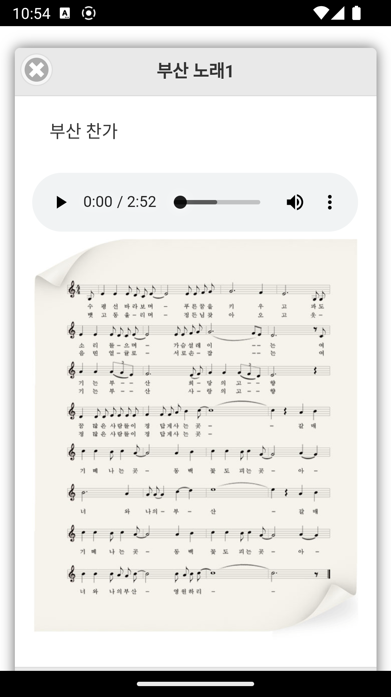

# 2023 고급 프로그래밍 과제 2
> 자신이 소개하고 싶은 곳

> Jquery Mobile를 사용한 Single Page 사이트 및 하이브리드 앱

## 추가/수정 내역
1. 부산 소개 페이지
2. 부산 관련 영상 페이지
3. 부산 관연 음악 페이지
4. 부산 관련 사진 페이지
5. 부산 기온
6. 지역별 인구 수
7. 스플래쉬 이미지 추가

## 환경
### 하드웨어
* Apple 2021 맥북프로 14 (M1 Pro 10Core X GPU 16Core X 1024GB X 32GB)

### 소트트웨어
* Jetbrains WebStorm
* Android Studio
* Gradle 8.0.2
* OpenJDK 1.8.0_292-b10
* Prettier
* Cordova

### 라이브러리
* Jquery 1.11.1
* Jquery Mobile 1.4.5
* chart.css 0.9.0
* cordova-plugin-splashscreen 6.0.2

### 사용 레퍼런스
* 원본 컨텐츠 : 박성진, 『모바일웹 + 웹앱 + 하이브리드앱 입문』, 생능출판사, 2017
* https://www.data.go.kr/tcs/dss/selectApiDataDetailView.do?publicDataPk=15107303
* https://www.data.go.kr/tcs/dss/selectApiDataDetailView.do?publicDataPk=15084084

## 스크린샷

